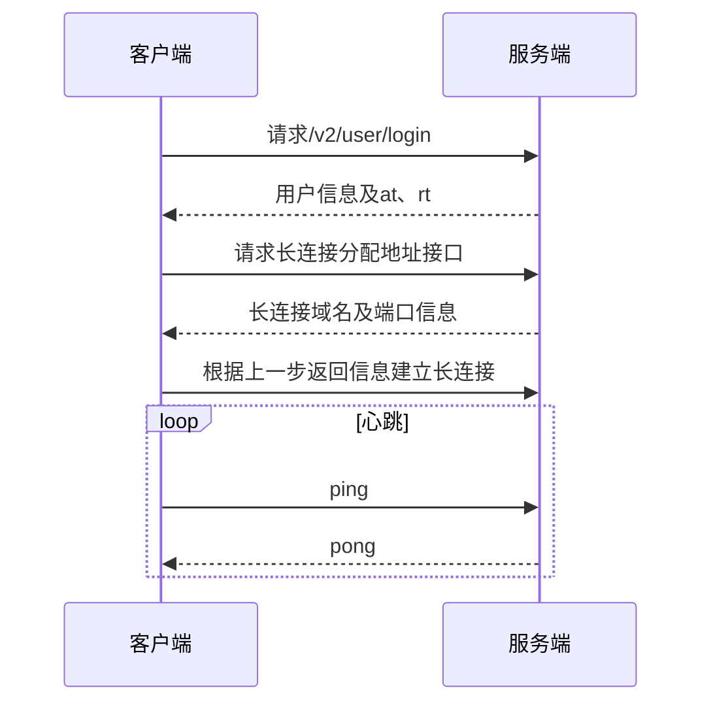
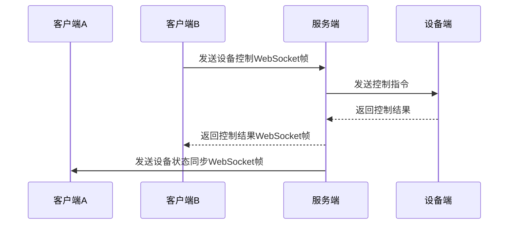

# 第二周

## 时序图

### 登录及建立长链接

### 设备控制以及状态同步

登录并建立长连接成功后：

## 思考问题

### 不同地区服务域名有什么不同

除了中国区域是.cn，其他都是.cc，前者面向中国大陆用户，后者面向国际用户

### 连接 websocket 的时候，为什么要先通过一个接口获取到连接地址

1. 该接口可以根据服务器实时连接数，负载情况，动态返回一个当前最空闲、合适的长链接地址，实现负载均衡
2. 如果某个服务器宕机，该接口可以感知这个异常，不给用户返回这个服务器的地址
3. 根据用户的ip，region等信息可以返回对应区域的websocket链接地址，可以降低延迟

### 怎么判断设备有4个通道

在本次demo里由于明确指明是这个四通道插座，所以demo代码里直接判断extra.uiid是不是4就可以了

| UI         | 描述       | UIID |
| ---------- | ---------- | ---- |
| 四通道插座 | 四通道插座 | 4    |

如果是判断任意一个设备是不是四通道，看params.switches数组的长度是不是4

### 请求登陆接口时，用到的加密属于什么加密？常见的加密有哪些类型？

登录接口的签名用的是HMAC-SHA256，是基于哈希的消息认证码，服务端拿到数据之后，可以把数据用相同的key用HMAC-SHA256再加密一遍，看一下加密出来的密文是不是和传过来的一样，由此来判断数据是否被篡改

加密类型有哈希加密，对称加密，非对称加密

### 访问接口时，为什么要携带 at？

让服务端检验请求者的权限，防止让攻击者获取到不该获取的信息

### 用户的设备是怎么管理的

家庭 - 房间（“其他”也看成一个房间） - 设备的树形结构
设备是这棵树的叶子节点

### 什么是 WebSocket 的心跳机制，为什么需要心跳机制

客户端和服务器端定期向对方发送一个心跳包(ping)，如果指定时间内未收到回复(pong)就认定链接已经断开，这时就需要重新建立WebSocket链接；通过心跳机制可以保证链接的可靠性

### 登陆时登陆接口会返回一个 at 和 rt，at 和 rt 分别有什么作用

accessToken用来给服务端校验权限，/v2/user/refresh需要传refreshToken刷新at和rt，at有效期是一个月，rt是两个月，在“access token” 失效前可通过 “刷新认证 token” 接口重新获取新的 “access token” 和 “Refresh Token”，让用户可以不用重新登录

### 怎么实现长连接的重连机制

首先，在每次发送心跳ping帧之后设立一个重连定时器，同时在ws.onmessage中监听特定格式的pong文本帧，接收到之后就把重连的定时器clearTimeout掉，没有接收到的话就让重连回调执行，执行重连逻辑；

其次，在ws.onclose中执行重连逻辑

自己手动处理心跳的原因是，很多时候，连接断开并不会触发浏览器或服务器端的`onclose`或`onerror`事件。例如，当用户将笔记本电脑合上进入休眠状态，或者手机网络从Wi-Fi切换到4G时，底层的TCP连接可能已经失效，但应用层并未立即感知，这种“静默断开”需要自己去检测

### 怎么获取用户帐号下的所有设备

先通过/v2/family 获取家庭和房间列表，对每一个family调用/v2/device/thing，可以拿到所有的设备

### 为什么会有4个大区的服务接口域名，假如只部署一个服务，全世界用户都使用同一个服务是否可行

不太好，只用一个服务就注定有些地方的延迟很高，而且中国大陆到海外的跨境带宽有限且不稳定，没有国内节点，大陆用户访问海外服务体验极差甚至完全不可达

